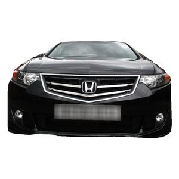

# Classifying images of cars by brand
**By: Zack Beucler**
**COM322 Final project**

The goal of this project was to build models to classify images of the fronts of cars by brand (Ford, Nissian, Honda, or Toyota). I was able to build three different models which all had varying levels of accuracy.

## Files
#### BOF_main.m
In this file, I created a model using the data collected from bag of features and used the classification learner to train an SVM. The type of SVM I picked was the Medium Gaussian SVM becasue it had the highest accuracy when trying to predict the training set (between 80% and 85%). However, when this model tried to predict the test set, it's accuracy decreased dramatically to only around 25%. 

#### BOF2_main.m
In this file, I created a model using data collected from bag of features and used the Matlab `trainImageCategoryClassifier()` method to train the model. This was a much higher-level approach and it produced better results. The model's accuracy when trying to predict the training set was about 85%. When trying to predict the test set, the model was able to get between 80% and 85% accuracy which is much better than the previous model.  

#### HOG_main.m
In this file, I created a model using data collected from HOG features and I used the `fitceco()` method to create a multiclass model. This model was much better than previous models. The model was able top The model's accuracy when predicting the training set was between 95% and 100%. The model's accuracy when predicting the test set was consistantly above 95% which greatly out performs the previous models.

#### Dataset: https://deepvisualmarketing.github.io/
The dataset I used was from the "confirmed fronts" dataset from this site. it was a huge dataset which was already labeled and had the background removed from each photo. The dataset contained 20+ car brands each with varying amounts of images. I was not able to add the datasets to this repo so please download them from the link above!

**Images per class**
Ford: 3436
Honda: 1303
Nissan: 2384
Toyota: 1776

Heres an example below

